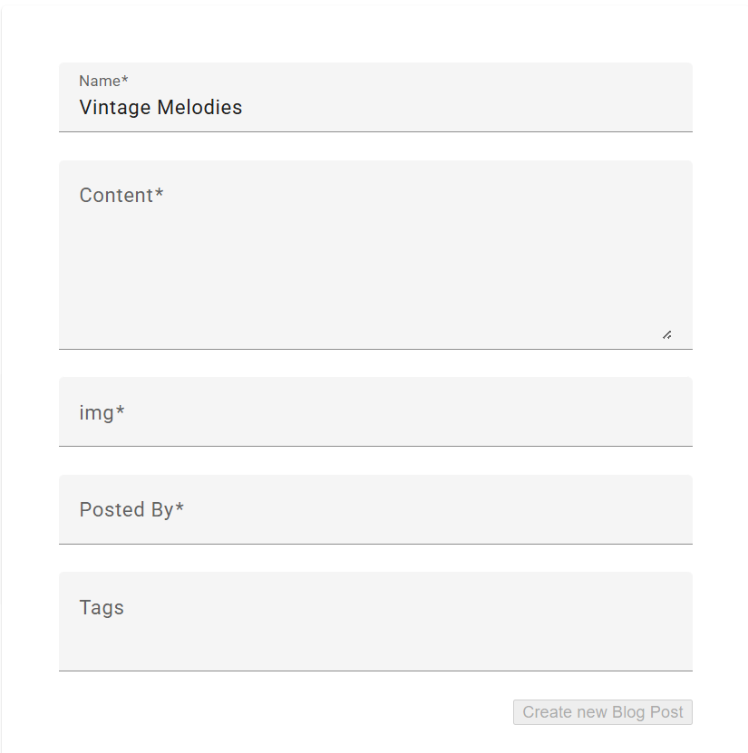

# 📝 AI-Powered Blog Application

This is a full-stack blog application built with **Spring Boot** and **Angular 17**, enhanced with **AI-powered blog title suggestions** using the **Gemma 3 4B model** via **Ollama** and **Spring AI**. The app enables users to create, view, like, and comment on blogs. Each blog tracks view counts and offers smart suggestions for titles using AI.

---


## 🚀 Features

- ✍️ **Create Blogs** — Users can create blog posts.
- 👀 **View Blogs** — Anyone can browse all blogs and view individual blog content.
- 👍 **Like & Comment** — Users can like and comment on blogs.
- 📊 **View Count** — Each blog tracks how many times it has been viewed.
- 🤖 **AI Title Suggestions** — Automatically generate 3 intelligent blog title suggestions using a locally running Gemma 3 4B model via Spring AI and Ollama.
- 🧑‍🎨 **Modern UI** — Built with Angular 17 and styled using Angular Material.
- 💾 **Persistent Storage** — Uses MySQL for storing blogs, users, comments, and likes.

---


## 🛠️ Tech Stack

### 🖥️ Frontend
- Angular 17
- Angular Material
- RxJS, TypeScript, SCSS

### 🧠 Backend
- Spring Boot 3.x
- Spring AI
- RESTful APIs
- MySQL
- Lombok, JPA/Hibernate

### 🤖 AI Integration
- Spring AI
- Ollama
- Gemma 3B/4B Model (running locally)

---


## ⚙️ Getting Started

### 📦 Prerequisites

- Node.js & npm
- Angular CLI
- Java 17+
- MySQL
- Maven
- Ollama (for local AI model)

---

### 🔧 Backend Setup (Spring Boot)

1. Clone the repository:
   ```bash
   git clone https://github.com/ashu-123/blogging
   cd blogging/blog
   ```

2. Configure your application.yml:

```yaml
spring.datasource.url=jdbc:mysql://localhost:3306/blog
spring.datasource.username=<your_username>
spring.datasource.password=<your_password>
spring.datasource.driver-class=com.mysql.cj.jdbc.Driver

spring.jpa.hibernate.ddl-auto=update
spring.jpa.show-sql=true

spring.ai.ollama.chat.options.model=gemma3:4b
```

3. Start the Spring Boot app:

```bash
./mvnw spring-boot:run
```

### 🖼️ Frontend Setup (Angular 17)

1. Navigate to the frontend:

```bash
cd ../blog-ui
```

2. Install dependencies:

```bash
npm install
```

3. Run the app:

```bash
ng serve
```

### 🤖 Running the AI Model (Ollama + Gemma)

1. Make sure Ollama is installed and running.
2. Run the model:

```bash
ollama run gemma3:4b
```

3. Ensure it's accessible at http://localhost:11434.

---

## ✨ AI Title Suggestion Example

When a user starts writing the title of a blog, Spring AI will prompt Gemma like this:

```css
Give 3 alternatives for the following blog post name: {blog post name}

Returned suggestions might be:

"Revolutionizing Web Apps with Spring AI"

"How I Added AI Magic to My Blog Platform"

"From Code to Creativity: AI-Enhanced Blogging"
```


---


## 📸 Screenshots 

1. Create a blog post



2. Blog created


2. Comments


---


## 📌 Future Enhancements
🧾 User authentication and roles (admin, author, reader)

📂 Blog categories & tags

📈 Analytics dashboard

📝 Markdown editor for blog content

🔔 Real-time notifications

---


## 📄 License
This project is licensed under the MIT License.

---


## 🤝 Contributing
Pull requests are welcome! For major changes, please open an issue first to discuss what you’d like to change.